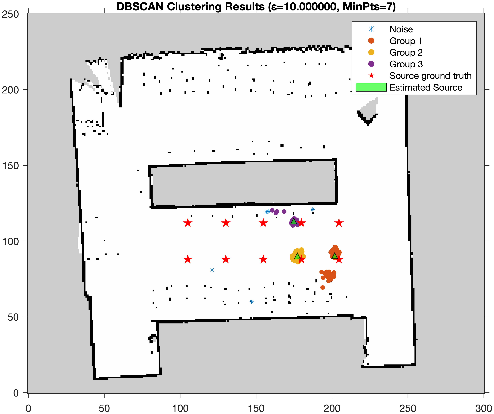
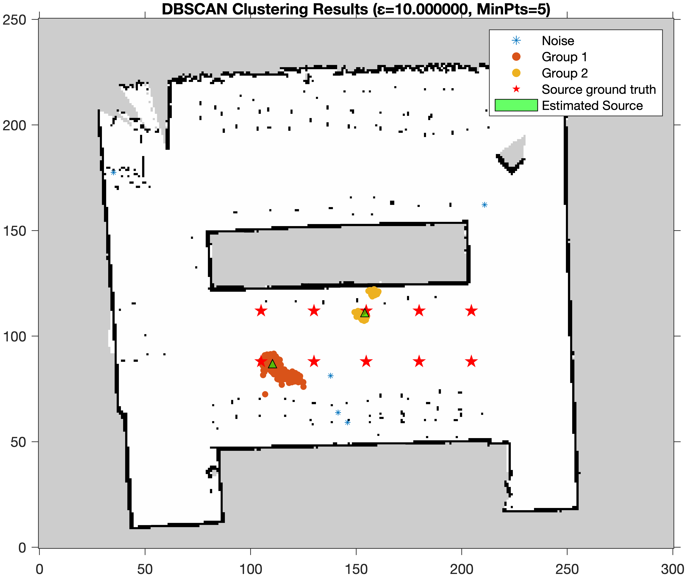
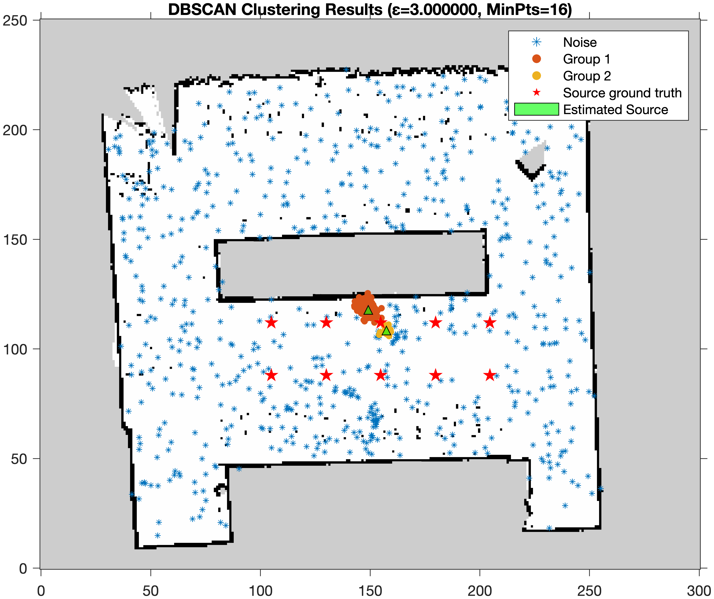

# 使用 DBSCAN 聚类进行声源位置估计

## DBSCAN 原理 [1]

DBSCAN 需要两个参数：ε (eps) 和形成高密度区域所需要的最少点数 (minPts)，它由一个任意未被访问的点开始，然后探索这个点的 ε-邻域，如果 ε-邻域里有足够的点，则建立一个新的聚类，否则这个点被标签为噪声。注意这个点之后可能被发现在其它点的 ε-邻域里，而该 ε-邻域可能有足够的点，届时这个点会被加入该聚类中。

如果一个点位于一个聚类的密集区域里，它的 ε-邻域里的点也属于该聚类，当这些新的点被加进聚类后，如果它(们)也在密集区域里，它(们)的 ε-邻域里的点也会被加进聚类里。这个过程将一直重复，直至不能再加进更多的点为止，这样，一个密度连结的聚类被完整地找出来。然后，一个未曾被访问的点将被探索，从而发现一个新的聚类或噪声。

## 伪代码 [2]

DBSCAN

- input: points, distance function, epsilon, minPts
- output: labels of points (belong to which group)

```pseudocode
DBSCAN(DB, distFunc, eps, minPts) {
    C := 0                                                 
    for each point P in database DB {
        if label(P) ≠ undefined then continue               
        Neighbors N := RangeQuery(DB, distFunc, P, eps)     
        if |N| < minPts then {                             
            label(P) := Noise                              
            continue
        }
        C := C + 1                                          
        label(P) := C                                       
        SeedSet S := N \ {P}                               
        for each point Q in S {                            
            if label(Q) = Noise then label(Q) := C          
            if label(Q) ≠ undefined then continue          
            label(Q) := C                                  
            Neighbors N := RangeQuery(DB, distFunc, Q, eps) 
            if |N| ≥ minPts then {                         
                S := S ∪ N                                 
            }
        }
    }
}

```

RangeQuery

```pseudocode
RangeQuery(DB, distFunc, Q, eps) {
    Neighbors N := empty list
    for each point P in database DB {                     
        if distFunc(Q, P) ≤ eps then {                    
            N := N ∪ {P}                                 
        }
    }
    return N
}

```


## 聚类参数

### 聚类参数选择

直接使用 grid search 遍历可能的参数集合，选择（相对）最优参数。

具体实现参考附件中的 code.m

---

| 粒子滤波轮数 | epsilon | minPts |
| ------------ | ------- | ------ |
| 5            | 10      | 7      |
| 8            | 10      | 5      |
| 10           | 3       | 16     |


## 聚类结果

### 第五轮粒子滤波聚类图示



### 第八轮粒子滤波聚类图示



### 第十轮粒子滤波聚类图示

可见该轮粒子滤波结果存在大量广泛分布的噪声，导致参数选择时 epsilon 较小以及 minPts 较大。




### 结果汇总

| 轮数       | 类别 | 粒子数       | 对应声源位置估计（m） | 与最近真值间的欧几里得距离（m） |
|-----------|---------------|--------------|----------------------|----------------------------|
| **Round 5** | Cluster 1  | 322          | 201.79               | 0.18544                    |
|              | Cluster 2 | 590          | 177.24               | 0.16866                    |
|              | Cluster 3 | 66           | 174.77               | 0.25912                    |
|              | Noise      | 5            | 0                    | /                          |
| **Round 8** | Cluster 1  | 852          | 110.4                | 0.27505                    |
|              | Cluster 2 | 126          | 154.11               | 0.056022                   |
|              | Noise      | 5            | 0                    | /                          |
| **Round 10** | Cluster 1  | 267          | 149.15               | 0.40437                    |
|              | Cluster 2 | 19           | 157.41               | 0.22251                    |
|              | Noise      | 697          | 0                    | /                          |
| **平均欧几里得距离（m）** |              |                      |                            | 0.22445              |


## 分析与讨论

epsilon 和 minPts 参数的选择对 DBSCAN 聚类的影响：

1. **较小的 ε 和较大的 minPts**：会导致更多的点被标记为噪声，因为难以满足簇的条件。

   面对大量广泛分布的噪声时效果较好，比如第十轮粒子滤波的结果。

2. **较大的 ε 和较小的 minPts**：会减少噪声点的数量，对数据点的密度要求低。


## 参考文献

[1] Wikipedia. (2024, May 19). DBSCAN. Retrieved from https://zh.wikipedia.org/wiki/DBSCAN

[2] Schubert, Erich; Sander, Jörg; Ester, Martin; [Kriegel, Hans Peter](https://en.wikipedia.org/wiki/Hans-Peter_Kriegel); Xu, Xiaowei (July 2017). ["DBSCAN Revisited, Revisited: Why and How You Should (Still) Use DBSCAN"](https://www.vitavonni.de/research/acm.html#item3068335). *ACM Trans. Database Syst*. **42** (3): 19:1–19:21. [doi](https://en.wikipedia.org/wiki/Doi_(identifier)):[10.1145/3068335](https://doi.org/10.1145%2F3068335). [ISSN](https://en.wikipedia.org/wiki/ISSN_(identifier)) [0362-5915](https://www.worldcat.org/issn/0362-5915). [S2CID](https://en.wikipedia.org/wiki/S2CID_(identifier)) [5156876](https://api.semanticscholar.org/CorpusID:5156876).